# Quantize Image Methods

Here you'll find different methods to quantize images in Python using clusterisation. Choose your favorite!

All of the functions used are not minimal examples of the different library's method they are using, the time measurements should be looked at with caution and only in the context of image quantization.

All time measurements where taken for 10 successive iterations of a method. Unless otherwise specified, the licenses of the used libraries are freely available for commercial use.
The code used to reproduce all results is available in this [file](demo_quantize_methods.py).

For the photos used for the tests, I tried to select sufficiently diverse ones to really show the specificity to be expected for each methods.
The authors of the photos are [Hanif Mahmad](https://unsplash.com/@anif) (for the first 5) and [Simon Launay](https://unsplash.com/@simonlaunay) (for the rest).

|               |               |               |               |
|:-------------:|:-------------:|:-------------:|:-------------:|
 |  |  | 
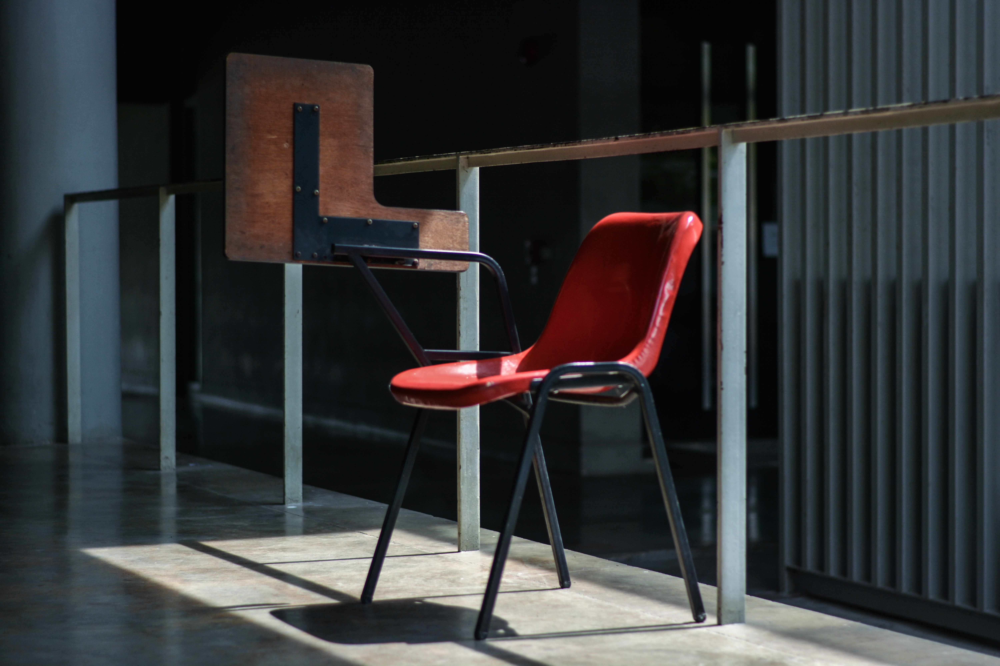 |  |  | 
 |  |  | 
 |  |  | 

The images where all reduced to a maximum size of 500px (width or height) before quantization (included in time measurement), except specified ones which needed an even smaller size to get back any kind of result.
And without further ado, here are the results:

## Pillow
[Pillow](https://pillow.readthedocs.io/en/stable/) is a rework of the PIL imaging library ; it is the only one of the contestants containing a function dedicated to quantizing.
The function takes a `method` parameter which can be any one of the following quantizing methods: median cut, maximum coverage, fast octree or the custom algorithm of [libimagequant](https://pngquant.org/lib/), 
but this one is an external, either GPL or commercial dependency, and to be able to use it you need to rebuild Pillow yourself while including it ; I didn't test it.
Pillow's quantize method require the precise number of colours that you want in the resulting image.
What I did to choose that number was to iterate over the quantize method, reducing the number of colours until there was none left covering less that 5% of the image.
Although the quantization is applied several times, the method is stilll the quickest by far, as you'll see next.
It is also the only method not using the `cv2.resize` to reduce the image size ; instead it uses Pillow's `Image.thumbnail`.

### Median cut

|               |               |               |               |
|:-------------:|:-------------:|:-------------:|:-------------:|
 |  |  | 
 |  |  | 
 |  |  | 
 |  |  | 
 |  |  | 
 |  |  | 
 |  |  | 
 |  |  | 

pillow_median_cut time : 2.677708653 s

The results are not bad, but you lose vivid colours that are not covering a lot of the image, like the monks' clothing or the road yellow line.

### Maximum coverage

|               |               |               |               |
|:-------------:|:-------------:|:-------------:|:-------------:|
 |  |  | 
 |  |  | 
 |  |  | 
 |  |  | 
 |  |  | 
 |  |  | 
 |  |  | 
 |  |  | 

pillow_maximum_coverage time : 1.9332736510000004 s

This method gives really interesting results. Objects are identifiable but some colours are really transformed and the number of colour might be to small for some.
The advantage is that you get no colour resembling each other in the colours extraction

### Fast octree

|               |               |               |               |
|:-------------:|:-------------:|:-------------:|:-------------:|
 | 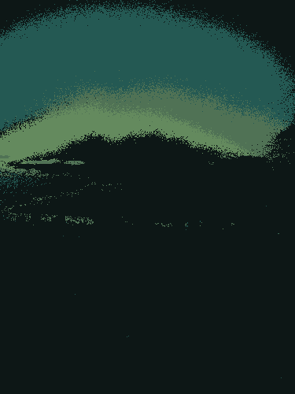 |  | 
 |  |  | 
 |  |  | 
 |  |  | 
 |  |  | 
 |  |  | 
 |  |  | 
 |  |  | 

pillow_fast_octree time : 0.47265442100000143 s

This method is by far the fastest one, but the results are really noisy and you lose a lot of vivid colours, even more than with Median cut.

## OpenCV
[OpenCV](https://opencv.org/) is a famous library containing utility functions for computer vision.
For these next set of functions, we are using the `cv2.kmeans` because the quantization problem can be in fact redefined as a clusterisation problem.
Three colour space will be tested, to see if we get better results in colour space where classic distance computation should have a better meaning.
Like the Pillow methods, the function is iterated until we get only colours that are sufficiently present in the image.
The threshold is 1% instead of 5% here, because we didn't get enough colours otherwise.

### RGB

|               |               |               |               |
|:-------------:|:-------------:|:-------------:|:-------------:|
 |  |  | 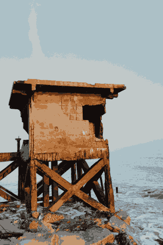
 |  |  | 
 |  |  | 
 |  |  | 
 |  |  | 
 |  |  | 
 |  | 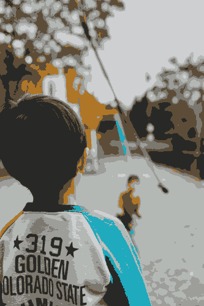 | 
 |  |  | 

opencv_rgb time : 32.54811209199988 s

Results are really good, the kmeans does really well at extracting the most important colours.
The default is that the time taken took a big leap for the worst compared to Pillow's methods.

### HSV

|               |               |               |               |
|:-------------:|:-------------:|:-------------:|:-------------:|
 | 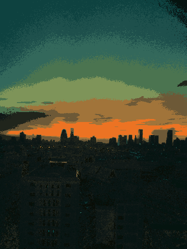 |  | 
 |  |  | 
 |  |  | 
 |  |  | 
 |  |  | 
 |  |  | 
 |  |  | 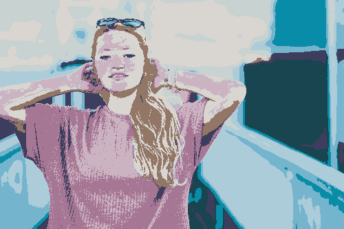
 |  |  | 

opencv_hsv time : 50.326093940999954 s

Since HSV is not really supposed to be a good fit for colour distancing, I expected much worse results.
Some colours have a wrong hue, but overall it's not that bad.
RGB is still more faithful and take less time, so you shouldn't use HSV.

### LAB

|               |               |               |               |
|:-------------:|:-------------:|:-------------:|:-------------:|
 |  |  | 
 |  |  | 
 |  | 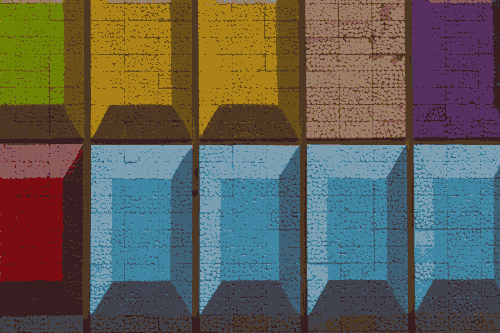 | 
 |  |  | 
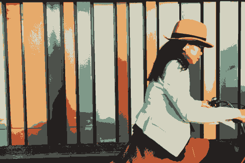 |  |  | 
 |  |  | 
 |  |  | 
 |  |  | 

opencv_lab time : 34.00670318699986 s

Lab should theoretically give better result than RGB, being a colour space created to give better distance measurement.
But the RGB already gives good results, and I don't see any visible improvement by using Lab.
Time taken also is similar, so you can probably use either one.
You should theoretically get better results by using Delta E 2000 instead of euclidian distance, but openCV doesn't give us the possibility to change the distance function.
Based upon these results, all following methods will use RGB colour space.

## SciPy

[SciPy](https://www.scipy.org/) is a library for scientific computing. Like OpenCV, it contains a function for KMeans, and that's what I used.
Unlike OpenCV, the function can be divided in two parts: the first find the centroids (fit), the second create the pixel clusters using those (predict).
The threshold of the minimum colour presence percentage was set at 2% which produced not too much nor too little colours.

### Without optimisation trick

|               |               |               |               |
|:-------------:|:-------------:|:-------------:|:-------------:|
 | 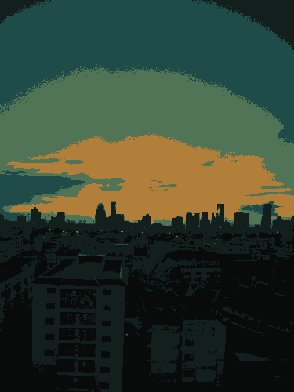 |  | 
 |  |  | 
 |  |  | 
 |  |  | 
 |  |  | 
 |  |  | 
 |  |  | 
 |  |  | 

scipy time : 524.6095604020002 s

We can see that the result is similar to those of the Median cut of Pillow: you lose some vivid minority colours.
But the main problem is the time ; using a threshold of 2% instead of 1%, I expected the function to take more time than the OpenCV equivalent.
But this is just ridiculous and unusable.
Fortunately, what you'll see next is a trick to get similar results in much less time.

### With optimisation trick

Since the quantization is done in two steps, we can compute the centroids on a randomized shuffle subset of the original image, and then apply the model to the whole image.

|               |               |               |               |
|:-------------:|:-------------:|:-------------:|:-------------:|
 |  |  | 
 |  |  | 
 |  |  | 
 |  |  | 
 |  |  | 
 |  |  | 
 |  |  | 
 |  |  | 

scipy2 time : 6.44186058299988 s

As you can see, the results are pretty much the same as those without optimisation, for a much more reasonable computation time, even much better than OpenCV.

## Scikit-learn

[Scikit-learn](https://scikit-learn.org/stable/) is specialised in machine learning tools (classification, regression and clustering).
We will use KMeans with same parameters and process as those used with SciPy, and we will try some other clusterisation functions available.

### KMeans without optimisation trick

|               |               |               |               |
|:-------------:|:-------------:|:-------------:|:-------------:|
 |  |  | 
 |  |  | 
 |  |  | 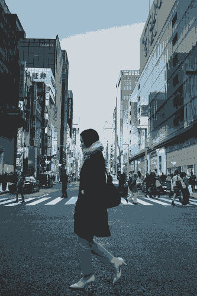
 |  |  | 
 | 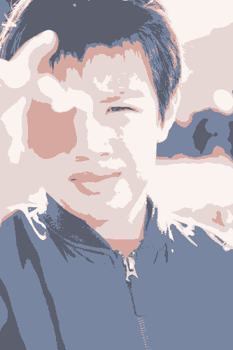 |  | 
 |  |  | 
 |  |  | 
 |  |  | 

sklearn_kmeans time : 292.4821637319999 s

The time is once again ridiculously long, but since we can use the same trick as with Scipy, let's see the results with it.

### KMeans with optimisation trick

|               |               |               |               |
|:-------------:|:-------------:|:-------------:|:-------------:|
 |  |  | 
 |  |  | 
 |  |  | 
 |  |  | 
 |  |  | 
 |  |  | 
 |  |  | 
 |  |  | 

sklearn_kmean2 time : 7.649859192999884 s

Like SciPy, we managed to have similar result for a much better time.
Unfortunately, there is one image, the road one, where the result of the quantization is actually visibly worse by using the optimisation, but such case should be rare.

### MiniBatchKMeans

MiniBatchKMeans is a variant of KMeans meant to take less computation time for a similar result.
Since we have already seen that quantizing on a random sample works relatively well, this function directly use the optimised version.

|               |               |               |               |
|:-------------:|:-------------:|:-------------:|:-------------:|
 |  |  | 
 |  |  | 
 |  |  | 
 |  |  | 
 |  |  | 
 |  |  | 
 |  |  | 
 |  |  | 

sklearn_mini_batch_kmeans time : 74.64295504700002 s

Contrarily to what is promised, we actually have worse time performance by using MiniBatchKMeans rather than KMeans, even though the rest of the implementation of the function is exactly the same.
Aside from that, the images result are similar, and even better for a few, to those of KMeans.

### MeanShift

MeanShift tries to discover "blobs" of data, and in a second step regroups together blobs that are near-duplicates.
Because of its implementation, there is no need to give this method the number of colours we want, it will chose it.
Since this method can be done in two steps (fit then predict), we will once again use a random sample for the fitting to reduce computation time.

|               |               |               |               |
|:-------------:|:-------------:|:-------------:|:-------------:|
 |  |  | 
 |  |  | 
 |  |  | 
 |  |  | 
 |  |  | 
 |  |  | 
 |  |  | 
 |  |  | 

sklearn_mean_shift time : 52.089231103 s

The resulting images are quite good, even if a lot of them are a bit to minimalistic in colours (except for the tunnel one which is surprisingly and uselessly detailed).
Time taken is quite long however.

## Pyclustering

[Pyclustering](https://pyclustering.github.io/), like its name implies, is specialised in clusterisation, but it uses a GPL license.
With it we are able to test several different cluster functions aside from K-Means.
CCORE included library is used to get better performances.

### BSAS

BSAS use a maximum allowable number of clusters and a threshold of dissimilarity as parameters, as well as the distance function to be used.
The number of clusters is then decided by the algorithm, and we don't need to loop and check pixel percentage coverage ourselves.

|               |               |               |               |
|:-------------:|:-------------:|:-------------:|:-------------:|
 |  |  | 
 |  |  | 
 |  |  | 
 |  |  | 
 |  |  | 
 |  |  | 
 |  |  | 
 |  |  | 

pycluster_bsas time : 33.03888442999994 s

The results are interesting, but clearly not adapted for colour quantization.
Some images are deformed, hardly recognisable, and some colours are not even the hue they should be.
Time taken is equivalent to OpenCV.

### MBSAS

MBSAS is similar to BSAS but for some implementation details I won't get into here.

|               |               |               |               |
|:-------------:|:-------------:|:-------------:|:-------------:|
 |  |  | 
 |  |  | 
 |  |  | 
 |  |  | 
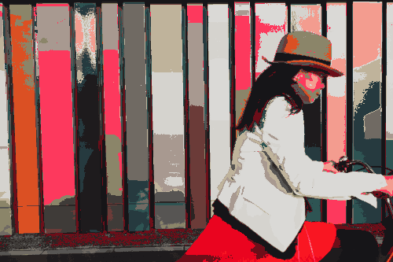 |  |  | 
 |  |  | 
 | 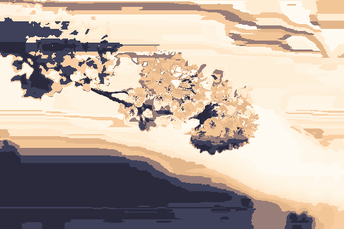 |  | 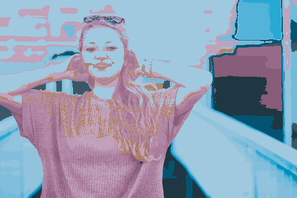
 |  |  | 

pycluster_mbsas time : 33.16758375900008 s

As expected, image and time results are comparable to those of BSAS.

### DBSCAN

|               |
|:-------------:|
||
||

pycluster_dbscan time : 102.73210900899994 s

With DBSCAN, not all pixel are guaranteed to be in a cluster, some samples are considered noisy and not included in a cluster.
In an image, you can't just decide a pixel is an outsider and not assign it to a cluster since it needs to have a colour.
Therefore you need a lot of clusters to be certain there will be no outsider.
Hence why I didn't test this algorithm on all the photos: as well as taking a lot of time, it is clearly not suitable for the quantization problem.

### OPTICS

|               |
|:-------------:|
||
||

pycluster_optics time : 122.5359561910002 s

OPTICS give similar results as those of DBSCAN which is expected since OPTICS is actually a lower memory consumption alternative to DBSCAN.
That's why we also didn't test sklearn.cluster.DBSCAN and sklearn.cluster.OPTICS: they would also gives outsiders.

### SyncNet
SyncNEt construct an oscillatory network to do clusterisation.
Because of that, it was impossible to use without greatly reducing the size of the image first: 83px maximum (function crashed on my machine on the original 500px maximum size).

|               |               |               |               |
|:-------------:|:-------------:|:-------------:|:-------------:|
 |  |  | 
 |  |  | 
 |  |  | 
 |  |  | 
 |  |  | 
 |  |  | 
 |  |  | 
 |  |  | 

pycluster_syncnet time : 334.00758747099985 s

The results are pretty poor, the number of selected colours fluctuates a lot between images and the time taken is much too high event though the image is 6 times smaller than those of the other methods.
This algorithm can't be used for quantization.

### SYNC-SOM

SYNC-SOM works similarly to SyncNet, with the same problem of needing small images to even function.

|               |               |               |               |
|:-------------:|:-------------:|:-------------:|:-------------:|
 |  |  | 
 |  |  | 
 |  |  | 
 |  |  | 
 |  |  | 
 |  |  | 
 |  |  | 
 |  |  | 

pycluster_syncsom time : 1103.5881241590002 s

The results are comparable to those of SyncNet while taking an even greater time to be computed.
This algorithm can't be used for quantization.

### TTSAS

TTSAS is an alternative to BSAS and MBSAS that uses two thresholds instead of one.

|               |               |               |               |
|:-------------:|:-------------:|:-------------:|:-------------:|
 |  |  | 
 |  |  | 
 |  |  | 
 |  |  | 
 | 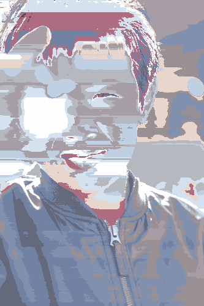 |  | 
 |  |  | 
 |  |  | 
 |  |  | 

pycluster_ttsas time : 32.75301202599985 s

One again, the result is similar to BSAS, and not adapted to image quantization.

### X-Means

X-Means works by giving it the minimum and maximum number of clusters you want and then dynamically grow from the minimum number until the result is satisfying.
I put the minimum at 2 clusters because that's the limit for an image not to be blank.
You also need to give the method the cluster centers starting position, but pyclustering possess a function, `kmeans_plusplus_initializer`, to initialise the given number of centers at good starting positions for this family of algorithms.

|               |               |               |               |
|:-------------:|:-------------:|:-------------:|:-------------:|
 |  |  | 
 |  |  | 
 |  |  | 
 |  |  | 
 | 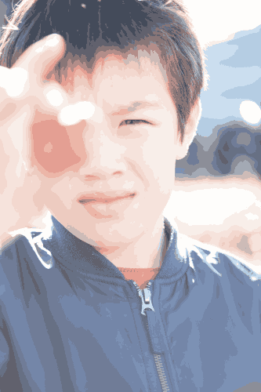 |  | 
 |  |  | 
 |  |  | 
 |  |  | 

pycluster_xmeans time : 61.51795905300014 s

Results are quite good, but the algorithm has a tendency to use the maximum number of colours, even on images where you would expect a very low number of colours to be needed, like the tunnel photo.
Time taken is twice that of OpenCV's KMeans.

### K-Means

Like X-Means, you need to give it the starting centers, for which you can use `kmeans_plusplus_initializer`.
Since pyclustering is slower than openCV and has more utility functions for clusterisation, instead of iterating to find a good number of clusters for each image, we use the Elbow Method to choose for us the optimal number of clusters for each image.

|               |               |               |               |
|:-------------:|:-------------:|:-------------:|:-------------:|
 |  |  | 
 |  |  | 
 |  |  | 
 |  |  | 
 |  |  | 
 |  |  | 
 |  |  | 
 |  |  | 

pycluster_kmeans time : 150.11819599299997 s

I think the images results are clearly the best ones we got yet, the Elbow Method is clearly efficient at choosing the appropriate number of colours.
The only image where it seems to be missing some colours is the chair one.
But the time taken is unfortunately quite high.

### K-Medians

K-Medians is similar to K-Means except that it compute medians instead of centroid, making it less vulnerable to outliers.

|               |               |               |               |
|:-------------:|:-------------:|:-------------:|:-------------:|
 | 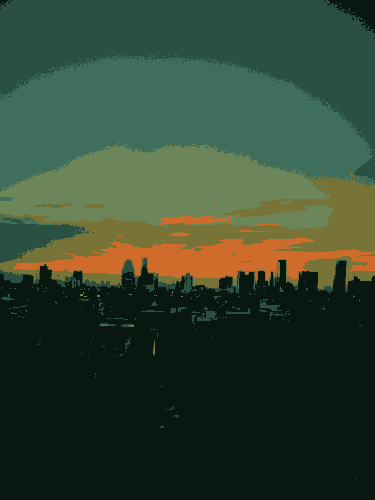 |  | 
 |  |  | 
 |  |  | 
 |  |  | 
 |  |  | 
 |  |  | 
 |  | 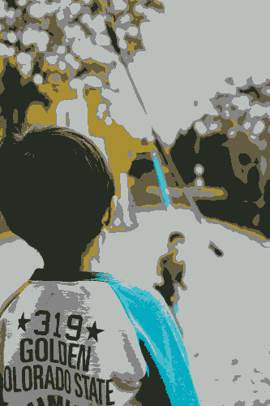 | 
 |  |  | 

pycluster_kmedians time : 188.61640517599972 s

The results are both slower and less faithful than K-Means.
It might be because when we look at an image, what our brain is doing is actually a mean of each colour area, hence why the colour seems so different when we take the median instead.

## Conclusion

Pillow's methods are, by a large margin, the fastest ones. Their image results aren't bad, but they are not the best either.
That prize goes to pyclustering's K-Means. But that function is very slow and, although it can probably be speeded up, the pyclustering library is under GPL, which might make it incompatible for some uses.
You'll need to take a decision depending on what requirements you have.
I hope these samples will help you to reach a decision if you one day need to do image quantization.

### Notes:
- The code used assumes that you are only using RGB images. It will need tweaking to support more image formats, but it won't be hard to do once you've chosen your method.
- I am not a professional benchmarker, but these time results are so far from each other that my naive implementation is probably enough to get an accurate idea of the time difference magnitude.
- The constants used as parameters for the different functions might not be the best ones, theses results were just produced to give me an idea of what to expect.
- This list is of course not exhaustive, don't hesitate to suggest other options to me!
